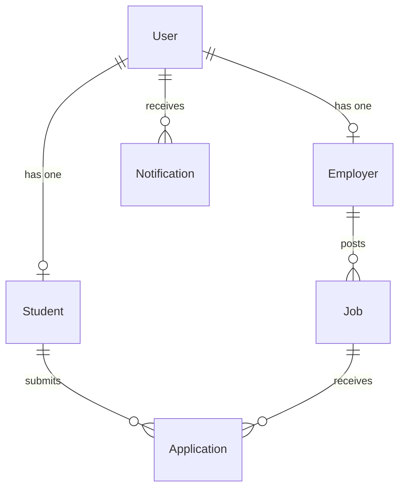

# BICS Portal — Full System Walkthrough & Code Review

## Table of Contents
1. [Architecture Overview](#1-architecture-overview)
2. [Database Layer — Prisma Schema](#2-database-layer--prisma-schema)
3. [Backend — Node.js / Express API](#3-backend--nodejs--express-api)
4. [AI Matching Service — FastAPI / Python](#4-ai-matching-service--fastapi--python)
5. [Frontend — React / TypeScript](#5-frontend--react--typescript)
6. [Key User Journeys](#6-key-user-journeys)
7. [Code Review — Strengths & Improvements](#7-code-review--strengths--improvements)

---

## 1. Architecture Overview

The system is a **microservice-style monorepo** with three independent services that communicate over HTTP.

```
Browser (React) ──HTTP──► Express API (port 3001) ──HTTP──► FastAPI AI (port 8000)
                                    │
                             PostgreSQL DB
                            (via Prisma ORM)
```

| Service | Tech | Port |
|---|---|---|
| Frontend | React 18, TypeScript, Vite, Tailwind, shadcn/ui | 8080 |
| Backend API | Node.js, Express, Prisma, JWT, Zod | 3001 |
| AI Service | Python, FastAPI, scikit-learn | 8000 |

---

## 2. Database Layer — Prisma Schema

**File:** [schema.prisma](file:///c:/Users/abrah/OneDrive/Documents/uniconnect%20(1)/uniconnect/backend/prisma/schema.prisma)

The schema defines **5 models** and **6 enums** in PostgreSQL. Here is how they relate:



### Models at a Glance

| Model | Key Fields | Notes |
|---|---|---|
| [User](file:///c:/Users/abrah/OneDrive/Documents/uniconnect%20%281%29/uniconnect/frontend/src/contexts/AuthContext.tsx#6-14) | [id](file:///c:/Users/abrah/OneDrive/Documents/uniconnect%20%281%29/uniconnect/frontend/src/contexts/AuthContext.tsx#26-144), `email`, `passwordHash`, `role` | Central auth record. Role is [student](file:///c:/Users/abrah/OneDrive/Documents/uniconnect%20%281%29/uniconnect/ai-service/main.py#103-114), `employer`, or `admin`. |
| [Student](file:///c:/Users/abrah/OneDrive/Documents/uniconnect%20%281%29/uniconnect/frontend/src/lib/api.ts#195-204) | `name`, `skills[]`, `placementStatus`, `resumeUrl` | [skills](file:///c:/Users/abrah/OneDrive/Documents/uniconnect%20%281%29/uniconnect/ai-service/matching.py#85-118) is a Postgres array. `placementStatus` tracks `seeking → interviewing → placed`. |
| [Employer](file:///c:/Users/abrah/OneDrive/Documents/uniconnect%20%281%29/uniconnect/frontend/src/lib/api.ts#205-214) | `companyName`, `industry`, `verified` | `verified` flag is set by admin. |
| [Job](file:///c:/Users/abrah/OneDrive/Documents/uniconnect%20%281%29/uniconnect/backend/src/controllers/employer.controller.ts#104-157) | `title`, `skills[]`, `requirements[]`, `status`, `deadline` | `status` is `draft → active → closed`. |
| [Application](file:///c:/Users/abrah/OneDrive/Documents/uniconnect%20%281%29/uniconnect/backend/src/controllers/student.controller.ts#225-280) | `status`, `matchScore`, `autoApplied`, `coverLetter` | `@@unique([jobId, studentId])` prevents duplicate applications. The `autoApplied` flag marks AI-triggered applications. |
| `Notification` | `type`, `title`, `message`, [read](file:///c:/Users/abrah/OneDrive/Documents/uniconnect%20%281%29/uniconnect/frontend/src/lib/api.ts#228-229) | Types: [match](file:///c:/Users/abrah/OneDrive/Documents/uniconnect%20%281%29/uniconnect/ai-service/matching.py#85-118), `status`, `application`, `system`. |

> [!IMPORTANT]
> `autoApplied: Boolean` is the key field enabling the system's most interesting feature — automatic application submission when AI match score exceeds 75%.

---

## 3. Backend — Node.js / Express API

**Entry Point:** [index.ts](file:///c:/Users/abrah/OneDrive/Documents/uniconnect%20(1)/uniconnect/backend/src/index.ts)

The server bootstraps Express with CORS (origin: `localhost:8080`), JSON body parsing, a static file server for `/uploads`, and mounts 6 route groups:

```
/api/auth          → auth.routes.ts
/api/students      → student.routes.ts
/api/employers     → employer.routes.ts
/api/jobs          → job.routes.ts
/api/admin         → admin.routes.ts
/api/notifications → notification.routes.ts
```

### 3.1 Authentication ([auth.controller.ts](file:///c:/Users/abrah/OneDrive/Documents/uniconnect%20%281%29/uniconnect/backend/src/controllers/auth.controller.ts))

**File:** [auth.controller.ts](file:///c:/Users/abrah/OneDrive/Documents/uniconnect%20(1)/uniconnect/backend/src/controllers/auth.controller.ts)

All input is validated with **Zod schemas** before any DB interaction.

| Function | What it does |
|---|---|
| [register()](file:///c:/Users/abrah/OneDrive/Documents/uniconnect%20%281%29/uniconnect/frontend/src/contexts/AuthContext.tsx#84-123) | Validates input → hashes password with `bcrypt` (10 rounds) → creates [User](file:///c:/Users/abrah/OneDrive/Documents/uniconnect%20%281%29/uniconnect/frontend/src/contexts/AuthContext.tsx#6-14) + role profile in a single Prisma nested write → returns JWT. |
| [login()](file:///c:/Users/abrah/OneDrive/Documents/uniconnect%20%281%29/uniconnect/frontend/src/contexts/AuthContext.tsx#56-83) | Finds user → `bcrypt.compare()` → returns JWT. Uses a generic "Invalid email or password" message to prevent user enumeration. |
| [getMe()](file:///c:/Users/abrah/OneDrive/Documents/uniconnect%20%281%29/uniconnect/backend/src/controllers/auth.controller.ts#150-179) | Reads the JWT from middleware → fetches fresh user+profile from DB → returns it. |
| [createAdminUser()](file:///c:/Users/abrah/OneDrive/Documents/uniconnect%20%281%29/uniconnect/backend/src/controllers/auth.controller.ts#180-222) | One-shot bootstrap endpoint. Checks if ANY admin exists first; throws if one does. |

> [!NOTE]
> Registration uses a **Prisma nested create** — it creates the [User](file:///c:/Users/abrah/OneDrive/Documents/uniconnect%20%281%29/uniconnect/frontend/src/contexts/AuthContext.tsx#6-14) and the [Student](file:///c:/Users/abrah/OneDrive/Documents/uniconnect%20%281%29/uniconnect/frontend/src/lib/api.ts#195-204)/[Employer](file:///c:/Users/abrah/OneDrive/Documents/uniconnect%20%281%29/uniconnect/frontend/src/lib/api.ts#205-214) profile in a single atomic transaction, which is good practice.

### 3.2 Student Controller ([student.controller.ts](file:///c:/Users/abrah/OneDrive/Documents/uniconnect%20%281%29/uniconnect/backend/src/controllers/student.controller.ts))

**File:** [student.controller.ts](file:///c:/Users/abrah/OneDrive/Documents/uniconnect%20(1)/uniconnect/backend/src/controllers/student.controller.ts)

| Function | What it does |
|---|---|
| [getProfile()](file:///c:/Users/abrah/OneDrive/Documents/uniconnect%20%281%29/uniconnect/backend/src/controllers/employer.controller.ts#30-71) | Returns student profile + last 5 applications. |
| [updateProfile()](file:///c:/Users/abrah/OneDrive/Documents/uniconnect%20%281%29/uniconnect/backend/src/controllers/employer.controller.ts#72-103) | Updates profile fields. **If skills are changed**, triggers background auto-application logic. |
| [applyToJob()](file:///c:/Users/abrah/OneDrive/Documents/uniconnect%20%281%29/uniconnect/frontend/src/lib/api.ts#146-148) | Validates job is active & deadline not passed → checks for duplicate → calls AI service for match score → creates [Application](file:///c:/Users/abrah/OneDrive/Documents/uniconnect%20%281%29/uniconnect/backend/src/controllers/student.controller.ts#225-280) → notifies employer. |
| [withdrawApplication()](file:///c:/Users/abrah/OneDrive/Documents/uniconnect%20%281%29/uniconnect/frontend/src/lib/api.ts#149-150) | Moves status to `withdrawn`. Blocked if already `hired` or `rejected`. |
| [acceptApplication()](file:///c:/Users/abrah/OneDrive/Documents/uniconnect%20%281%29/uniconnect/backend/src/controllers/student.controller.ts#462-503) | Converts an auto-applied application to a manually-accepted one (`autoApplied: false`). |

#### The Auto-Apply Feature (on profile update)
When a student updates their skills, a **fire-and-forget async block** runs in the background:
1. Finds all active jobs the student hasn't applied to yet.
2. Calls the AI matching service in bulk.
3. For every job where `match_score > 75`, creates an [Application](file:///c:/Users/abrah/OneDrive/Documents/uniconnect%20%281%29/uniconnect/backend/src/controllers/student.controller.ts#225-280) record with `autoApplied: true`.
4. Sends the student a notification.

### 3.3 Employer Controller ([employer.controller.ts](file:///c:/Users/abrah/OneDrive/Documents/uniconnect%20%281%29/uniconnect/backend/src/controllers/employer.controller.ts))

**File:** [employer.controller.ts](file:///c:/Users/abrah/OneDrive/Documents/uniconnect%20(1)/uniconnect/backend/src/controllers/employer.controller.ts)

| Function | What it does |
|---|---|
| [createJob()](file:///c:/Users/abrah/OneDrive/Documents/uniconnect%20%281%29/uniconnect/backend/src/controllers/employer.controller.ts#158-290) | Creates the job. If `status === "active"`, triggers background auto-apply for all matching students. |
| [getCandidates()](file:///c:/Users/abrah/OneDrive/Documents/uniconnect%20%281%29/uniconnect/frontend/src/lib/api.ts#174-175) | Fetches all non-placed students, calls AI service using an aggregate employer profile built from all the employer's job skills. |
| [updateApplicationStatus()](file:///c:/Users/abrah/OneDrive/Documents/uniconnect%20%281%29/uniconnect/frontend/src/lib/api.ts#171-173) | Updates status and sends student a notification. Also updates `placementStatus` on the [Student](file:///c:/Users/abrah/OneDrive/Documents/uniconnect%20%281%29/uniconnect/frontend/src/lib/api.ts#195-204) record (`hired` → `placed`, `interview_scheduled` → `interviewing`). |

#### The Auto-Apply Feature (on job creation)
When a new active job is posted:
1. Fetches all students not yet `placed`.
2. Sends all their profiles to the AI service in bulk.
3. For each student: sends a "New Relevant Job" notification.
4. For students with `match_score > 75`: also auto-creates an [Application](file:///c:/Users/abrah/OneDrive/Documents/uniconnect%20%281%29/uniconnect/backend/src/controllers/student.controller.ts#225-280).

---

## 4. AI Matching Service — FastAPI / Python

**Files:** [main.py](file:///c:/Users/abrah/OneDrive/Documents/uniconnect%20(1)/uniconnect/ai-service/main.py), [matching.py](file:///c:/Users/abrah/OneDrive/Documents/uniconnect%20(1)/uniconnect/ai-service/matching.py)

### API Endpoints

| Endpoint | Purpose |
|---|---|
| `POST /match/job-to-student` | Single pair match (used per application) |
| `POST /match/jobs-for-student` | Batch: one student vs. many jobs |
| `POST /match/students-for-job` | Batch: one job vs. many students |

Results are returned **sorted by `match_score` descending**.

### The Matching Algorithm (`MatchingService.calculate_match`)

The final score is a **weighted combination** of two signals:

```
Final Score = (Skill Score × 60%) + (Semantic Score × 40%)
```

**1. Skill Score (60% weight)**
- Lowercases and strips all skills.
- Checks for exact match, partial match (substring), or common aliases (e.g., `js` ↔ `javascript`, `node` ↔ `nodejs`).
- `score = (matching_skills / total_job_skills) × 100`

**2. Semantic Score (40% weight)**
- Builds a **text document** for the student: concatenated skills + field of study + bio.
- Builds a **text document** for the job: skills + requirements + title + description.
- Runs **TF-IDF vectorization** (1- and 2-gram, top 1000 features, English stop words removed).
- Computes **cosine similarity** between the two vectors.

**Score normalization:**
- If all job skills match: score is capped at 100.
- Otherwise: `final = max(45, min(100, combined_score))` — scores are floored at 45 to avoid discouraging results.

**Recommendation text** is generated based on final score:
- ≥ 85 → "Excellent match!"
- ≥ 70 → "Good match! Consider developing: ..."
- ≥ 55 → "Moderate match. Key skills to develop: ..."
- < 55 → "This role may require significant skill development."

---

## 5. Frontend — React / TypeScript

### Application Bootstrap

**Files:** [main.tsx](file:///c:/Users/abrah/OneDrive/Documents/uniconnect%20(1)/uniconnect/frontend/src/main.tsx) → [App.tsx](file:///c:/Users/abrah/OneDrive/Documents/uniconnect%20(1)/uniconnect/frontend/src/App.tsx)

The app is wrapped in this provider stack from outermost to innermost:
`QueryClientProvider` → [AuthProvider](file:///c:/Users/abrah/OneDrive/Documents/uniconnect%20%281%29/uniconnect/frontend/src/contexts/AuthContext.tsx#26-144) → `TooltipProvider` → `BrowserRouter`

### Routing & Route Protection ([App.tsx](file:///c:/Users/abrah/OneDrive/Documents/uniconnect%20%281%29/uniconnect/frontend/src/App.tsx))

All role-specific pages are wrapped in a [ProtectedRoute](file:///c:/Users/abrah/OneDrive/Documents/uniconnect%20%281%29/uniconnect/frontend/src/App.tsx#37-60) component that:
1. Shows a spinner while `isLoading` is true.
2. Redirects to `/login` if not authenticated.
3. Redirects to `/` if authenticated but wrong role for that page.

| Route prefix | Allowed role |
|---|---|
| `/student/*` | [student](file:///c:/Users/abrah/OneDrive/Documents/uniconnect%20%281%29/uniconnect/ai-service/main.py#103-114) |
| `/employer/*` | `employer` |
| `/admin/*` | `admin` |

### Authentication State ([AuthContext.tsx](file:///c:/Users/abrah/OneDrive/Documents/uniconnect%20%281%29/uniconnect/frontend/src/contexts/AuthContext.tsx))

**File:** [AuthContext.tsx](file:///c:/Users/abrah/OneDrive/Documents/uniconnect%20(1)/uniconnect/frontend/src/contexts/AuthContext.tsx)

- On mount, reads the `token` from `localStorage` and calls `/api/auth/me` to rehydrate the user session.
- [login()](file:///c:/Users/abrah/OneDrive/Documents/uniconnect%20%281%29/uniconnect/frontend/src/contexts/AuthContext.tsx#56-83) and [register()](file:///c:/Users/abrah/OneDrive/Documents/uniconnect%20%281%29/uniconnect/frontend/src/contexts/AuthContext.tsx#84-123) call the API, store the token in `localStorage`, and set the user state.
- [logout()](file:///c:/Users/abrah/OneDrive/Documents/uniconnect%20%281%29/uniconnect/frontend/src/contexts/AuthContext.tsx#124-128) clears the token and sets user to `null`.

### API Client ([api.ts](file:///c:/Users/abrah/OneDrive/Documents/uniconnect%20%281%29/uniconnect/frontend/src/lib/api.ts))

**File:** [api.ts](file:///c:/Users/abrah/OneDrive/Documents/uniconnect%20(1)/uniconnect/frontend/src/lib/api.ts)

A singleton [ApiClient](file:///c:/Users/abrah/OneDrive/Documents/uniconnect%20%281%29/uniconnect/frontend/src/lib/api.ts#13-115) class wraps the native `fetch` API:
- Reads `token` from `localStorage` and automatically injects `Authorization: Bearer <token>` on every request.
- Handles file uploads separately using `FormData` (skipping the `Content-Type: application/json` header).
- Returns a normalized `{ data?, error?, errors? }` object — components never see raw fetch responses.

Exported API modules: `authApi`, `studentApi`, `employerApi`, `jobsApi`, `adminApi`, `notificationsApi`.

---

## 6. Key User Journeys

### Student Journey
```
Register → Login (JWT stored) → Complete Profile (add skills) →
  [auto-apply background job fires]
Browse Jobs → Apply → Cover letter submitted → AI score calculated & stored →
  Employer notified → Employer updates status → Student notified at each stage
```

### Employer Journey
```
Register → Admin verifies account → Post Job (set status: active) →
  [auto-apply background job fires for all matching students]
View Applications (sorted by match score) → Update Status → Student is notified
Browse Candidates (AI-matched to employer's aggregate job profile)
```

### Admin Journey
```
Bootstrap admin account (one-time curl) → Login → View analytics dashboard →
Verify employer accounts → Manage student/employer lists → View all jobs
```

---

## 7. Code Review — Strengths & Improvements

### ✅ Strengths

- **Zod validation everywhere**: All request bodies are strictly validated before DB access. This significantly reduces the surface area for bad data.
- **Atomic DB writes**: Registration creates [User](file:///c:/Users/abrah/OneDrive/Documents/uniconnect%20%281%29/uniconnect/frontend/src/contexts/AuthContext.tsx#6-14) and profile in one Prisma transaction.
- **Duplicate guard**: `@@unique([jobId, studentId])` on [Application](file:///c:/Users/abrah/OneDrive/Documents/uniconnect%20%281%29/uniconnect/backend/src/controllers/student.controller.ts#225-280) is enforced at the database level — even if application logic fails, the DB will reject duplicates.
- **Graceful AI fallback**: Both auto-apply flows and the manual apply-to-job flow wrap the AI service call in a try/catch. If the AI service is down, the backend defaults to a score of `0` and continues — the system doesn't break.
- **Non-blocking background jobs**: Auto-apply logic runs as a fire-and-forget IIFE [(async () => { ... })()](file:///c:/Users/abrah/OneDrive/Documents/uniconnect%20%281%29/uniconnect/frontend/src/lib/api.ts#72-79) so the API response is returned immediately and users aren't left waiting.
- **Role-based access control**: Every controller function checks `req.user.role` as its first step and throws a 403 if the role is wrong.

### ⚠️ Potential Improvements

| Area | Issue | Suggestion |
|---|---|---|
| **Auto-apply scalability** | On a new job post, the system fetches ALL non-placed students and sends them all to the AI at once. | Implement pagination or a queue (e.g., Bull/BullMQ) for large user bases. |
| **AI service: no auth** | The FastAPI service has no authentication — any process on the same network can call it. | Add a shared secret/API key check between the Express backend and FastAPI. |
| **Score floor of 45** | Scores are normalized to `[45, 100]`. A student with zero matching skills still scores 45%. | Consider showing "< 50%" as "Low match" to set expectations, rather than inflating the number. |
| **`autoApplied` reset on accept** | [acceptApplication()](file:///c:/Users/abrah/OneDrive/Documents/uniconnect%20%281%29/uniconnect/backend/src/controllers/student.controller.ts#462-503) sets `autoApplied: false` — this is used as a way to "convert" an auto-apply. | A dedicated `acceptedByStudent: Boolean` field would be clearer. |
| **Admin has no role check** | [createAdminUser](file:///c:/Users/abrah/OneDrive/Documents/uniconnect%20%281%29/uniconnect/backend/src/controllers/auth.controller.ts#180-222) only checks if an admin exists, not if the caller IS an admin. | Once one admin exists, this endpoint is blocked, but it should also be locked behind an admin JWT for safety. |
| **No refresh tokens** | JWTs appear to be long-lived (no expiry mentioned). | Add a short expiry + refresh token rotation for production. |
| **`any` types in frontend** | Many API response types in [api.ts](file:///c:/Users/abrah/OneDrive/Documents/uniconnect%20%281%29/uniconnect/frontend/src/lib/api.ts) are typed as `any`. | Define TypeScript interfaces for all API responses to catch errors at compile time. |
